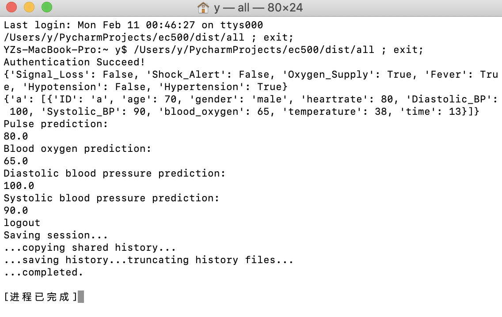
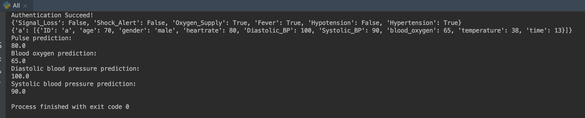

# exercise-1-modularity-YanzuWuu
exercise-1-modularity-YanzuWuu created by GitHub Classroom

We used dictionary to simulate database.
The structure is as followed:

data format of infodic:
{
    'XXXXXX(user_id)': [{
        'time': '2019-02-06 17:11',
        'gender': 'male',
        'heartrate': 100,
        'blood_pressure': 125,
        'blood_oxygen': 0.7
        },
        {
            ...
        }
    ]
}
And the result of the .py file is :

The exe file is also created, the result is as followed.

